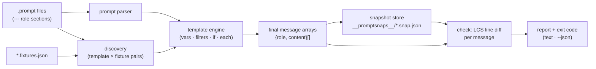

# promptsnap

[English](README.md) | [中文](README.zh.md) | [日本語](README.ja.md)

[](LICENSE)   [](CONTRIBUTING.md)

**プロンプトテンプレートのスナップショットテスト：fixture でレンダリングし、最終メッセージ配列を正確に diff。オフライン・決定的・LLM 呼び出しゼロ。**


```bash
# not yet on npm — install from a checkout of this repository
npm install && npm run build && npm pack
npm install -g ./promptsnap-0.1.0.tgz
```

## なぜ promptsnap？

プロンプトテンプレートの劣化は、ソフトウェアで最も気づきにくい類のものです。誰かが helper を抽出し、変数名を変え、few-shot 例の順序を入れ替え、空白を「ついでに整理」する——コードレビューは無害に見え、ユニットテストは全部グリーンのまま、3 週間後にサポートから「ボットが VIP チケットをエスカレーションしなくなった」と問い合わせが来る。バグはコードには一度もなかった。変わったのは*レンダリング後のプロンプト*で、パイプラインの誰もそこを見ていなかったのです。既存の答えはどれも配線の反対側を見張っています。promptfoo のような評価フレームワークは*モデル出力*を判定するため、API キー・レイテンシ・コスト、そして本質的には決定的な文字列組み立てバグに対する非決定的な判定が伴います。汎用の Jest スナップショットはレンダリング済み文字列を保存できますが、メッセージ配列のことは何も知りません——得られるのは不透明な blob 一つで、メッセージ単位・行単位の diff も、fixture ペアリング規約も、CI がプロンプトディレクトリ全体に走らせられる CLI もない。promptsnap はレンダリング工程そのものに欠けていた回帰テストです：テンプレートはコミット済み fixture で正確な `{role, content}` 配列にレンダリングされ、スナップショットはテンプレートの隣で git に入り、`promptsnap check` は変化したまさにそのメッセージに対して unified 行 diff を出して失敗します。キーなし・ネットワークなし・モデルなし——モデルが見るはずだったバイト列が変わったなら、本番ではなく pull request の時点で分かります。

| | promptsnap | promptfoo | Jest `toMatchSnapshot` | 目視 diff |
|---|---|---|---|---|
| モデル出力ではなくレンダリング済みメッセージをテスト | ✅ 中核機能 | ❌ 出力評価 | 🟡 blob、自前配線 | 🟡 推測頼み |
| API キー / ネットワークが必要 | ✅ 不要 | ❌ 実評価では必要 | ✅ 不要 | ✅ 不要 |
| 決定的な合否 | ✅ バイト単位 | ❌ モデル依存 | ✅ | ❌ |
| メッセージを理解する diff（ロール・順序・行 hunk） | ✅ | ❌ | ❌ 文字列 blob | ❌ |
| テンプレート × fixture のペアリング規約 | ✅ 組み込み | 🟡 テスト設定 | ❌ 手作り | ❌ |
| レンダリング時に欠落変数を捕捉 | ✅ 厳格、行:列つき | 🟡 場合による | ❌ 空でレンダリング | ❌ |
| ランタイム依存 | ✅ ゼロ | ❌ 数十 | ❌ Jest スタック | — |

<sub>比較は各ツールの 2026-07 時点の公開ドキュメントと挙動に基づく。promptsnap はレンダリング工程だけをテストします——プロンプトがモデルを良く振る舞わせるかは意図的に判定しません。そこは評価フレームワークと併用してください。正確なセマンティクスは [docs/template-syntax.md](docs/template-syntax.md) を参照。</sub>

## 特徴

- **スナップショットするのはモデルが見るもの** — （テンプレート × fixture）の各ペアが正確な `{role, content}[]` 配列にレンダリングされ、テンプレート隣の `__promptsnaps__/` に決定的 JSON としてコミットされる。スナップショットの git diff が*そのまま*プロンプト変更になる。
- **文字列 blob ではなくメッセージを理解する diff** — `check` はメッセージを位置で整列し、各スロットをロール変更・内容変更（unified `@@` 行 hunk つき）・追加・削除に分類する。「few-shot 例が動いた」は本物の回帰だから。
- **すでに知っている Jest ワークフロー** — `snap` で記録、`check` で検証、`check --update` で受理、`snap --prune` で陳腐化スナップショットを掃除、CI 向け終了コード 0/1/2、機械向けに `--json`。
- **プロンプトのための厳格なテンプレート言語** — few-shot ターンを書ける `--- role` セクション、`{{ var }}` パス、フィルタ（`json`・`join`・`default`・`upper`・`indent` など）、`{{#if}}`/`{{#each}}`、スタンドアロン行除去により条件ブロックが空行を残さない。
- **データ欠落は座標つきで大声で失敗** — 未提供の変数はファイル・行・列と、fixture が*実際に*提供している名前一覧を添えて中断する。オブジェクトが `[object Object]` になることはなく、null は `| default` を案内する。静かに空になるプロンプトこそ本ツールが捕まえるバグ。
- **ランタイム依存ゼロ、完全オフライン** — テンプレートエンジン・LCS diff・CLI はすべてリポジトリ内実装。必要なのは Node.js だけ、devDependency は `typescript` のみ、ソケットは決して開かない。

## クイックスタート

テンプレートとその fixture を並べて書きます：

```text
# prompts/support.prompt
--- system
You are the support agent for {{ product }}.
Answer in at most {{ maxWords }} words.
{{#if vip}}
Offer a callback for anything you cannot resolve.
{{/if}}
--- user
{{ question }}
```

その隣に `prompts/support.fixtures.json` を置きます——トップレベルの各キーが 1 つの名前つき変数セットで、それぞれが独立したスナップショットになります：

```json
{
  "vip":  { "product": "Acme Cloud", "maxWords": 80, "vip": true,
            "question": "My dashboard is empty since this morning." },
  "free": { "product": "Acme Cloud", "maxWords": 80, "vip": false,
            "question": "How do I export my data?" }
}
```

スナップショットを記録してコミットし、CI に `check` を走らせます：

```bash
promptsnap snap prompts/
```

```text
✓ prompts/support.prompt · free → prompts/__promptsnaps__/support.free.snap.json
✓ prompts/support.prompt · vip → prompts/__promptsnaps__/support.vip.snap.json
2 written, 0 unchanged · 2 pairs
```

後日、リファクタリングが system メッセージに触れる。`promptsnap check prompts/` は終了コード 1 で、影響を受けた各 fixture が今何をレンダリングするかを正確に示します（実際にキャプチャした実行）：

```text
✗ prompts/support.prompt · free
  message[0] system — content changed
    @@ -1,2 +1,2 @@
     You are the support agent for Acme Cloud.
    -Answer in at most 80 words.
    +Answer in at most 80 words, plain text only.
  1 changed of 2 messages
✗ prompts/support.prompt · vip
  message[0] system — content changed
    @@ -1,3 +1,3 @@
     You are the support agent for Acme Cloud.
    -Answer in at most 80 words.
    +Answer in at most 80 words, plain text only.
     Offer a callback for anything you cannot resolve.
  1 changed of 2 messages
0 matched, 2 mismatched · 2 pairs
```

意図した変更なら `promptsnap check --update`（または `snap`）で新しいレンダリングを受理し、スナップショット diff はテンプレート変更と同じコミットに入ります。few-shot ターン・ループ・`json:2` 埋め込み設定を使った大きめの実例は [examples/](examples/README.md) にあります。

## コマンド

| コマンド | 動作 | 主なオプション |
|---|---|---|
| `snap [paths…]` | 全ペアをレンダリングしスナップショットを書き込み/更新 | `--prune` |
| `check [paths…]` | 再レンダリングしてスナップショットと diff、ドリフトで失敗 | `--update`・`--context N`・`--json` |
| `render <t.prompt>` | 1 ペアの正確なメッセージ配列を表示 | `--fixture`・`--vars`・`--json` |
| `ls [paths…]` | 発見したテンプレート・fixture・スナップショット状態を一覧 | |

パスはディレクトリ（再帰走査；`node_modules`・`dist`・ドットディレクトリはスキップ）または単一の `.prompt` ファイルで、既定は `.`。終了コード：`0` クリーン、`1` ドリフト（不一致・欠落・陳腐化スナップショット、レンダリングエラー）、`2` 用法または入力エラー。

## 何がドリフトになるか

| 変更 | check の報告 |
|---|---|
| どのメッセージのどの内容バイトでも | `content changed` + unified hunk |
| メッセージのロール | `role changed system -> user` |
| メッセージの追加 / 削除 / 並べ替え | `added` / `removed`（位置ベース diff） |
| fixture がある変数を提供しなくなった | `render error`：パス・ファイル・行:列を明示 |
| 対応するペアのないスナップショット | `obsolete`（`snap --prune` で削除） |
| 空の `#if` 分岐が残す末尾空白 | なし —— 設計として正規化で吸収 |

レンダリング内容は正規化されます（各メッセージの先頭空行と末尾空白を除去）。見えないノイズがスナップショットを反転させることはなく、見える変化は必ず反転させます。完全なセマンティクスは [docs/template-syntax.md](docs/template-syntax.md) を参照。

## アーキテクチャ



## ロードマップ

- [x] `.prompt` フォーマット、厳格テンプレートエンジン、fixture ペアリング、決定的スナップショット、メッセージ対応 LCS diff、snap/check/render/ls CLI、90 テスト + smoke スクリプト（v0.1.0）
- [ ] `promptsnap.config.json`：roots・ignore glob・既定 context 幅
- [ ] hunk 内の単語レベル行内ハイライト
- [ ] メッセージ内の構造化コンテンツ部品（画像/ツール呼び出しプレースホルダ）
- [ ] `check` 出力へのメッセージ別トークン数差分（差し替え可能なカウンタ）
- [ ] ローカルテンプレート編集の watch モード
- [ ] npm への公開

全リストは [open issues](https://github.com/JaydenCJ/promptsnap/issues) を参照。

## コントリビュート

コントリビュート歓迎です。`npm install && npm run build` でビルドし、`npm test` と `bash scripts/smoke.sh`（`SMOKE OK` を出力すること）を実行してください——このリポジトリは CI を持たず、上記の主張はすべてローカル実行で検証されます。[CONTRIBUTING.md](CONTRIBUTING.md) を読み、[good first issue](https://github.com/JaydenCJ/promptsnap/issues?q=is%3Aissue+is%3Aopen+label%3A%22good+first+issue%22) を選ぶか、[discussion](https://github.com/JaydenCJ/promptsnap/discussions) を始めてください。

## ライセンス

[MIT](LICENSE)
