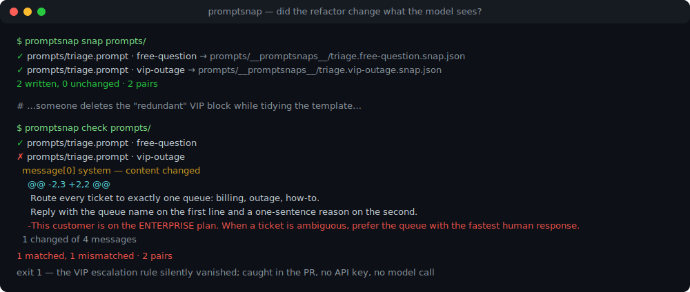
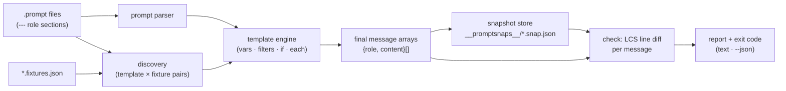

# promptsnap

[English](README.md) | [中文](README.zh.md) | [日本語](README.ja.md)

[](LICENSE)   [](CONTRIBUTING.md)

**Snapshot testing for prompt templates: render with fixtures, diff the exact final message arrays. Offline, deterministic, zero LLM calls.**



```bash
# not yet on npm — install from a checkout of this repository
npm install && npm run build && npm pack
npm install -g ./promptsnap-0.1.0.tgz
```

## Why promptsnap?

Prompt templates rot in the least visible way software can. Someone extracts a helper, renames a variable, reorders the few-shot examples, "tidies up" whitespace — the code review looks harmless, every unit test stays green, and three weeks later support asks why the bot stopped escalating VIP tickets. The bug was never in the code: the *rendered prompt* changed, and nothing in the pipeline was looking at it. The existing answers all watch the wrong end of the wire. Eval frameworks like promptfoo judge *model outputs*, which means API keys, latency, cost, and nondeterministic verdicts on what was actually a deterministic string-assembly bug. Generic Jest snapshots can capture a rendered string, but they know nothing about message arrays — you get one opaque blob with no per-message, per-line diff, no fixture pairing convention, and no CLI your CI can run against a whole prompt directory. promptsnap is the missing regression test for the rendering step itself: templates render with committed fixtures into exact `{role, content}` arrays, snapshots live in git next to the templates, and `promptsnap check` fails with a unified line diff on the precise message that changed. No key, no network, no model — if the bytes the model would have seen changed, you find out in the pull request, not in production.

| | promptsnap | promptfoo | Jest `toMatchSnapshot` | eyeballing the diff |
|---|---|---|---|---|
| Tests the rendered messages, not model output | ✅ the core feature | ❌ output evals | 🟡 blob, if you wire it | 🟡 you infer it |
| Needs an API key / network | ✅ never | ❌ for real evals | ✅ no | ✅ no |
| Deterministic pass/fail | ✅ byte-exact | ❌ model-dependent | ✅ | ❌ |
| Message-aware diff (role, order, per-line hunks) | ✅ | ❌ | ❌ string blob | ❌ |
| Template × fixture pairing convention | ✅ built in | 🟡 test config | ❌ hand-rolled | ❌ |
| Catches missing variables at render time | ✅ strict, with line:col | 🟡 depends | ❌ renders empty | ❌ |
| Runtime dependencies | ✅ zero | ❌ dozens | ❌ Jest stack | — |

<sub>Comparison against each tool's public docs and behavior, 2026-07. promptsnap tests the rendering step only — it deliberately says nothing about whether the prompt makes the model behave; pair it with an eval framework for that, and see [docs/template-syntax.md](docs/template-syntax.md) for exact semantics.</sub>

## Features

- **Snapshots of what the model would see** — every (template × fixture) pair renders to an exact `{role, content}[]` array, committed as deterministic JSON under `__promptsnaps__/` next to the template; the git diff of a snapshot *is* the prompt change.
- **A message-aware diff, not a string blob** — `check` aligns messages by position and classifies each slot as role change, content change (with unified `@@` line hunks), added or removed, because "the few-shot examples moved" is a real regression.
- **The Jest workflow you already know** — `snap` to record, `check` to verify, `check --update` to accept, `snap --prune` for obsolete snapshots, exit codes 0/1/2 for CI; `--json` for machines.
- **A strict template language built for prompts** — `--- role` sections with few-shot turns, `{{ var }}` paths, filters (`json`, `join`, `default`, `upper`, `indent`, …), `{{#if}}`/`{{#each}}` with standalone-line stripping so conditionals never leave blank lines behind.
- **Missing data fails loudly, with coordinates** — an unprovided variable aborts with file, line, column and the names the fixture *does* provide; objects never render as `[object Object]`, nulls point at `| default`. A silently-empty prompt is the bug this tool exists to catch.
- **Zero runtime dependencies, fully offline** — the template engine, LCS diff and CLI are all in-repo; Node.js is the only requirement, `typescript` the sole devDependency, and no socket is ever opened.

## Quickstart

Write a template and its fixtures, side by side:

```text
# prompts/support.prompt
--- system
You are the support agent for {{ product }}.
Answer in at most {{ maxWords }} words.
{{#if vip}}
Offer a callback for anything you cannot resolve.
{{/if}}
--- user
{{ question }}
```

And next to it, `prompts/support.fixtures.json` — every top-level key is one named variable set, and every set becomes its own snapshot:

```json
{
  "vip":  { "product": "Acme Cloud", "maxWords": 80, "vip": true,
            "question": "My dashboard is empty since this morning." },
  "free": { "product": "Acme Cloud", "maxWords": 80, "vip": false,
            "question": "How do I export my data?" }
}
```

Record the snapshots, commit them, and let CI run `check`:

```bash
promptsnap snap prompts/
```

```text
✓ prompts/support.prompt · free → prompts/__promptsnaps__/support.free.snap.json
✓ prompts/support.prompt · vip → prompts/__promptsnaps__/support.vip.snap.json
2 written, 0 unchanged · 2 pairs
```

Later, a refactor touches the system message. `promptsnap check prompts/` exits 1 and shows exactly what every affected fixture now renders (real captured run):

```text
✗ prompts/support.prompt · free
  message[0] system — content changed
    @@ -1,2 +1,2 @@
     You are the support agent for Acme Cloud.
    -Answer in at most 80 words.
    +Answer in at most 80 words, plain text only.
  1 changed of 2 messages
✗ prompts/support.prompt · vip
  message[0] system — content changed
    @@ -1,3 +1,3 @@
     You are the support agent for Acme Cloud.
    -Answer in at most 80 words.
    +Answer in at most 80 words, plain text only.
     Offer a callback for anything you cannot resolve.
  1 changed of 2 messages
0 matched, 2 mismatched · 2 pairs
```

Intended? `promptsnap check --update` (or `snap`) accepts the new rendering and the snapshot diff goes into the same commit as the template change. A bigger worked example — few-shot turns, loops, `json:2`-embedded config — lives in [examples/](examples/README.md).

## Commands

| Command | Does | Key options |
|---|---|---|
| `snap [paths…]` | render every pair, write/update snapshots | `--prune` |
| `check [paths…]` | re-render, diff against snapshots, fail on drift | `--update`, `--context N`, `--json` |
| `render <t.prompt>` | print one pair's exact message array | `--fixture`, `--vars`, `--json` |
| `ls [paths…]` | list discovered templates, fixtures, snapshot state | |

Paths are directories (walked recursively; `node_modules`, `dist` and dot-dirs skipped) or single `.prompt` files, default `.`. Exit codes: `0` clean, `1` drift (mismatched, missing or obsolete snapshots, render errors), `2` usage or input error.

## What counts as drift

| Change | check says |
|---|---|
| Any content byte of any message | `content changed` + unified hunks |
| A message's role | `role changed system -> user` |
| Message added / removed / reordered | `added` / `removed` (positional diff) |
| Fixture stops providing a variable | `render error` naming path, file, line:col |
| Snapshot with no matching pair | `obsolete` (remove with `snap --prune`) |
| Trailing whitespace from an empty `#if` branch | nothing — normalized away by design |

Rendered content is normalized (leading blank lines and trailing whitespace stripped per message) so invisible churn never flips a snapshot; every visible change does. Full semantics in [docs/template-syntax.md](docs/template-syntax.md).

## Architecture



## Roadmap

- [x] `.prompt` format, strict template engine, fixture pairing, deterministic snapshots, message-aware LCS diff, snap/check/render/ls CLI, 90 tests + smoke script (v0.1.0)
- [ ] `promptsnap.config.json` for roots, ignore globs and default context width
- [ ] Word-level intra-line highlighting inside hunks
- [ ] Structured content parts (image/tool-call placeholders) in messages
- [ ] Token-count deltas per message in `check` output (pluggable counters)
- [ ] Watch mode for local template editing
- [ ] Publish to npm

See the [open issues](https://github.com/JaydenCJ/promptsnap/issues) for the full list.

## Contributing

Contributions are welcome. Build with `npm install && npm run build`, then run `npm test` and `bash scripts/smoke.sh` (must print `SMOKE OK`) — this repository ships no CI, every claim above is verified by local runs. See [CONTRIBUTING.md](CONTRIBUTING.md), grab a [good first issue](https://github.com/JaydenCJ/promptsnap/issues?q=is%3Aissue+is%3Aopen+label%3A%22good+first+issue%22), or start a [discussion](https://github.com/JaydenCJ/promptsnap/discussions).

## License

[MIT](LICENSE)
