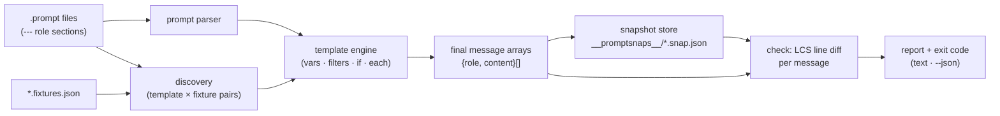

# promptsnap

[English](README.md) | [中文](README.zh.md) | [日本語](README.ja.md)

[](LICENSE)   [](CONTRIBUTING.md)

**提示词模板的快照测试：用 fixture 渲染，对最终消息数组做精确 diff。离线、确定性、零 LLM 调用。**


```bash
# not yet on npm — install from a checkout of this repository
npm install && npm run build && npm pack
npm install -g ./promptsnap-0.1.0.tgz
```

## 为什么是 promptsnap？

提示词模板的腐坏是软件中最不易察觉的一种。有人抽了个 helper、重命名了变量、调换了 few-shot 示例的顺序、"顺手整理"了空白——代码评审看起来人畜无害，单元测试全绿，三周后客服来问机器人为什么不再升级 VIP 工单了。bug 从来不在代码里：变的是*渲染后的提示词*，而流水线里没有任何环节盯着它。现有方案全都盯错了线路的另一端。promptfoo 之类的评测框架评判的是*模型输出*，意味着 API key、延迟、费用，以及对一个本质上是确定性字符串拼装 bug 的非确定性裁决。通用的 Jest 快照可以存一个渲染后的字符串，但它对消息数组一无所知——你得到的是一团不透明的 blob，没有逐消息、逐行的 diff，没有 fixture 配对约定，也没有能让 CI 扫整个提示词目录的 CLI。promptsnap 就是渲染环节缺失的那个回归测试：模板用已提交的 fixture 渲染成精确的 `{role, content}` 数组，快照跟模板一起进 git，`promptsnap check` 在恰好变化的那条消息上以统一行 diff 报错退出。不要 key、不联网、不碰模型——只要模型本应看到的字节变了，你在 pull request 里就会知道，而不是在生产环境里。

| | promptsnap | promptfoo | Jest `toMatchSnapshot` | 肉眼看 diff |
|---|---|---|---|---|
| 测试渲染后的消息而非模型输出 | ✅ 核心功能 | ❌ 输出评测 | 🟡 blob，需自己接线 | 🟡 靠推断 |
| 需要 API key / 网络 | ✅ 从不 | ❌ 真实评测需要 | ✅ 不需要 | ✅ 不需要 |
| 确定性的通过/失败 | ✅ 字节级精确 | ❌ 依赖模型 | ✅ | ❌ |
| 消息感知的 diff（角色、顺序、逐行 hunk） | ✅ | ❌ | ❌ 字符串 blob | ❌ |
| 模板 × fixture 配对约定 | ✅ 内置 | 🟡 测试配置 | ❌ 手搓 | ❌ |
| 渲染期捕获缺失变量 | ✅ 严格，带行:列 | 🟡 看情况 | ❌ 渲染成空 | ❌ |
| 运行时依赖 | ✅ 零 | ❌ 几十个 | ❌ Jest 全家桶 | — |

<sub>对比基于各工具 2026-07 的公开文档与行为。promptsnap 只测试渲染环节——它刻意不评判提示词能否让模型表现更好；那部分请搭配评测框架，精确语义见 [docs/template-syntax.md](docs/template-syntax.md)。</sub>

## 特性

- **快照的是模型将看到的东西** — 每个（模板 × fixture）对渲染成精确的 `{role, content}[]` 数组，以确定性 JSON 提交在模板旁的 `__promptsnaps__/` 下；快照的 git diff *就是*提示词变更本身。
- **消息感知的 diff，不是字符串 blob** — `check` 按位置对齐消息，把每个槽位归类为角色变更、内容变更（带统一 `@@` 行 hunk）、新增或删除，因为"few-shot 示例挪位了"是真实的回归。
- **你早已熟悉的 Jest 工作流** — `snap` 记录、`check` 校验、`check --update` 接受、`snap --prune` 清理过期快照，退出码 0/1/2 供 CI 使用；`--json` 供机器消费。
- **为提示词而生的严格模板语言** — 带 few-shot 轮次的 `--- role` 分节、`{{ var }}` 路径、过滤器（`json`、`join`、`default`、`upper`、`indent` 等）、`{{#if}}`/`{{#each}}`，独立行剥离让条件块绝不留下空行。
- **数据缺失会大声报错，还带坐标** — 未提供的变量会中止渲染，报出文件、行、列以及 fixture *确实*提供了哪些名字；对象绝不渲染成 `[object Object]`，null 会提示 `| default`。悄悄变空的提示词正是本工具要抓的 bug。
- **零运行时依赖，完全离线** — 模板引擎、LCS diff 和 CLI 全部在仓库内实现；唯一要求是 Node.js，唯一 devDependency 是 `typescript`，永远不会打开任何 socket。

## 快速上手

并排写好模板和它的 fixture：

```text
# prompts/support.prompt
--- system
You are the support agent for {{ product }}.
Answer in at most {{ maxWords }} words.
{{#if vip}}
Offer a callback for anything you cannot resolve.
{{/if}}
--- user
{{ question }}
```

再在它旁边放上 `prompts/support.fixtures.json`——每个顶层键是一组命名变量，每组各自生成一份快照：

```json
{
  "vip":  { "product": "Acme Cloud", "maxWords": 80, "vip": true,
            "question": "My dashboard is empty since this morning." },
  "free": { "product": "Acme Cloud", "maxWords": 80, "vip": false,
            "question": "How do I export my data?" }
}
```

记录快照、提交，然后让 CI 跑 `check`：

```bash
promptsnap snap prompts/
```

```text
✓ prompts/support.prompt · free → prompts/__promptsnaps__/support.free.snap.json
✓ prompts/support.prompt · vip → prompts/__promptsnaps__/support.vip.snap.json
2 written, 0 unchanged · 2 pairs
```

之后某次重构动了 system 消息。`promptsnap check prompts/` 以退出码 1 结束，并展示每个受影响 fixture 现在渲染成了什么（真实捕获的运行）：

```text
✗ prompts/support.prompt · free
  message[0] system — content changed
    @@ -1,2 +1,2 @@
     You are the support agent for Acme Cloud.
    -Answer in at most 80 words.
    +Answer in at most 80 words, plain text only.
  1 changed of 2 messages
✗ prompts/support.prompt · vip
  message[0] system — content changed
    @@ -1,3 +1,3 @@
     You are the support agent for Acme Cloud.
    -Answer in at most 80 words.
    +Answer in at most 80 words, plain text only.
     Offer a callback for anything you cannot resolve.
  1 changed of 2 messages
0 matched, 2 mismatched · 2 pairs
```

是有意为之？`promptsnap check --update`（或 `snap`）接受新的渲染结果，快照 diff 和模板变更进同一个 commit。更完整的示例——few-shot 轮次、循环、`json:2` 内嵌配置——见 [examples/](examples/README.md)。

## 命令

| 命令 | 作用 | 关键选项 |
|---|---|---|
| `snap [paths…]` | 渲染所有 pair，写入/更新快照 | `--prune` |
| `check [paths…]` | 重新渲染并与快照 diff，漂移即失败 | `--update`、`--context N`、`--json` |
| `render <t.prompt>` | 打印某个 pair 的精确消息数组 | `--fixture`、`--vars`、`--json` |
| `ls [paths…]` | 列出发现的模板、fixture 与快照状态 | |

路径可以是目录（递归遍历；跳过 `node_modules`、`dist` 和点目录）或单个 `.prompt` 文件，默认 `.`。退出码：`0` 干净，`1` 漂移（快照不匹配、缺失或过期、渲染错误），`2` 用法或输入错误。

## 什么算漂移

| 变更 | check 的报告 |
|---|---|
| 任何消息的任何内容字节 | `content changed` + 统一 hunk |
| 消息的角色 | `role changed system -> user` |
| 消息新增 / 删除 / 换序 | `added` / `removed`（按位置 diff） |
| fixture 不再提供某个变量 | `render error`，报出路径、文件、行:列 |
| 没有对应 pair 的快照 | `obsolete`（用 `snap --prune` 清除） |
| 空 `#if` 分支留下的尾部空白 | 无 —— 按设计归一化掉 |

渲染内容会做归一化（每条消息剥掉行首空行和行尾空白），因此不可见的噪声不会翻转快照；而每个可见变化都会。完整语义见 [docs/template-syntax.md](docs/template-syntax.md)。

## 架构



## 路线图

- [x] `.prompt` 格式、严格模板引擎、fixture 配对、确定性快照、消息感知 LCS diff、snap/check/render/ls CLI、90 个测试 + smoke 脚本（v0.1.0）
- [ ] `promptsnap.config.json`：roots、ignore glob、默认 context 宽度
- [ ] hunk 内的词级行内高亮
- [ ] 消息中的结构化内容部件（图片/工具调用占位符）
- [ ] `check` 输出中的逐消息 token 数变化（可插拔计数器）
- [ ] 本地模板编辑的 watch 模式
- [ ] 发布到 npm

完整列表见 [open issues](https://github.com/JaydenCJ/promptsnap/issues)。

## 参与贡献

欢迎贡献。先 `npm install && npm run build` 构建，再跑 `npm test` 和 `bash scripts/smoke.sh`（必须打印 `SMOKE OK`）——本仓库不带 CI，以上所有断言都由本地运行验证。参见 [CONTRIBUTING.md](CONTRIBUTING.md)，认领一个 [good first issue](https://github.com/JaydenCJ/promptsnap/issues?q=is%3Aissue+is%3Aopen+label%3A%22good+first+issue%22)，或发起一场 [discussion](https://github.com/JaydenCJ/promptsnap/discussions)。

## 许可证

[MIT](LICENSE)
